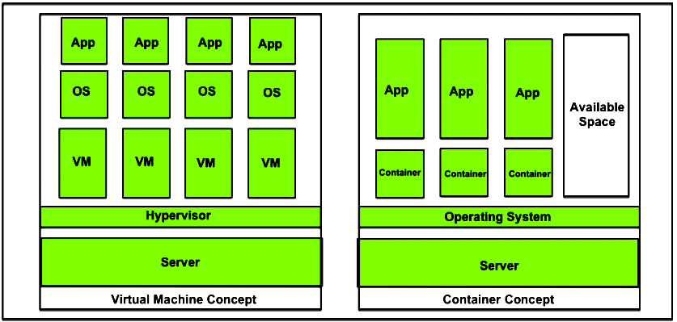

 
 

* * *

## what is docker ?

<a href="https://github.com/docker/docker-ce" target="_blank" >Docker</a>
 is a set of platform as a service (PaaS) products that use OS-level virtualization to deliver software in packages called containers.Containers are isolated from one another and bundle their own software, libraries and configuration files; they can communicate with each other through well-defined channels. All containers are run by a single operating-system kernel and are thus more lightweight than virtual machines.
 docker is written in Go language.
 
<a href="https://en.wikipedia.org/wiki/Docker_(software)" target="_blank">source wikipedia</a>

in simple word <mark>Docker</mark> solve the classic case of "it works on my machine"
 

 
by providing <a href="https://en.wikipedia.org/wiki/OS-level_virtualization" target="_blank"> OS-level virtualization </a>

* * *

## Virtualisation and alternative to virtual machines <mark>Docker Containers</mark>

In a software driven world where omnipresence and ease of deployment with minimum overheads are the major requirements, the cloud promptly takes its place in every picture. Containers are creating their mark in this vast expanse of cloud space with the world’s top technology and IT establishments relying on the concept for their infrastructural necessities. Tech giants like Facebook, Google and Microsoft use containers in their streamlined processes to facilitate a secure and easy deployment into the cloud production environments. This deployment with containers offers a technique, which abstracts the application from the run-time environment; much like virtual machines and this is done, of course by virtualization.

The two core concepts to be explored here are:

<ol>
<li>How containers are built on virtualization technique</li>
<li>How they offer an alternative to virtual machines</li>
</ol>
 

 
 

1.  How containers are built on virtualization technique ?

Virtualization is a technique, which essentially creates an illusion of a resource such as a desktop, storage, network or an operating system. Devices, applications and human users possess the capability of interacting with these resources. This illusion also called virtualization expands the capabilities of traditional systems, which are limited by their own physical resources.

Now, containers enable this virtualization for applications that are deployed in them. Applications in containers run independently, isolated from any physical resource. Containers virtualize the OS, CPU, memory, storage and network resources there by providing a controlled environment that can be scaled up or down as required. A container also packages the application along with its dependencies and necessary files, which enables the application to be deployed on any environment without having to configure the server, hardware or software

This still sounds similar to virtualization implemented through virtual machines right?So before we get into what more containers can do let us clean up how containers differ from virtual machines

2.  How they offer an alternative to virtual machines ?

A virtual machine is a form of hardware virtualization. The hardware is logically separated from the other resources. The hardware can be any system such as a desktop (with hardware and its own OS) called the host machine, on which several virtual machines or guest machines can run, each with their own separate operating systems. This is made possible by a firmware called the hypervisor.

Containers like virtual machines, run on a host machines. They can also be controlled as needed and provide isolation of application from the run-time environment. However, containers aim at operating system virtualization. Unlike virtual machines, in a containerized system guest operating systems need not be installed on the host system. Instead, the underlying host operating system is shared by all instances of containers containing the application code. This makes containers light weight and reduces operating system overheads associated with virtual machines such as patching, upgrading, driver support etc. Moreover, it reduces the amount of resources of the host machine consumed by the presence of individual operating systems.

* * *

## Benefits of containers:

<ul>
<li>Applications can be deployed without any worry about the run time environment. As a result, an application can easily be moved through the software development cycle and can run anywhere, for example, on Mac OS, Linux, Windows and even in data centers. This results in less expenditure of time on examining the environment and more time can be time on developing new functionality.</li>
<li>Multiple containers with applications can be run on the same instance of physical resource sharing an operating system. These containers being lightweight are fast and efficiently utilize the computing resources available.</li>
<li>Containers are isolated from one another, which gives the developer the leeway to split application services into different containers. These containers do not share any dependencies and each can be manipulated and updated by the developer at will.</li>
<li>Containers come with the inbuilt capability of version control.</li>
</ul>

<a href="https://www.geeksforgeeks.org/virtualisation-with-docker-containers/" target="_blank"> source gfg</a>

* * *

## Operation of docker

Docker can package an application and its dependencies in a virtual container that can run on any Linux server. This helps provide flexibility and portability enabling the application to be run in various locations, whether on-premises, in a public cloud, or in a private cloud. Docker uses the resource isolation features of the Linux kernel (such as cgroups and kernel namespaces) and a union-capable file system (such as OverlayFS) to allow containers to run within a single Linux instance, avoiding the overhead of starting and maintaining virtual machines. Because Docker containers are lightweight, a single server or virtual machine can run several containers simultaneously. A 2018 analysis found that a typical Docker use case involves running eight containers per host, but that a quarter of analyzed organizations run 18 or more per host.

The Linux kernel's support for namespaces mostly isolates an application's view of the operating environment, including process trees, network, user IDs and mounted file systems, while the kernel's cgroups provide resource limiting for memory and CPU. Since version 0.9, Docker includes its own component (called "libcontainer") to directly use virtualization facilities provided by the Linux kernel, in addition to using abstracted virtualization interfaces via libvirt, LXC and systemd-nspawn.

Docker implements a high-level API to provide lightweight containers that run processes in isolation.

* * *

## Components of docker

The Docker software as a service offering consists of three components:

<ol>
<li> <b>Software:</b> The Docker daemon, called dockerd, is a persistent process that manages Docker containers and handles container objects. The daemon listens for requests sent via the Docker Engine API. The Docker client program, called docker, provides a command-line interface that allows users to interact with Docker daemons.
</li>
 
<li><b>Objects:</b> Docker objects are various entities used to assemble an application in Docker. The main classes of Docker objects are images, containers, and services. 
A Docker container is a standardized, encapsulated environment that runs applications. A container is managed using the Docker API or CLI.
A Docker image is a read-only template used to build containers. Images are used to store and ship applications. 
A Docker service allows containers to be scaled across multiple Docker daemons. The result is known as a swarm, a set of cooperating daemons that communicate through the Docker API.</li>
 
<li><b>Registries:</b> A Docker registry is a repository for Docker images. Docker clients connect to registries to download ("pull") images for use or upload ("push") images that they have built. Registries can be public or private. Two main public registries are Docker Hub and Docker Cloud. Docker Hub is the default registry where Docker looks for images. Docker registries also allow the creation of notifications based on events.</li>

* * *

## installing docker on linux

Docker can be installed in two versions of Docker CE(Community Edition) and Docker EE(Enterprise Edition). For small-scale projects, or for learning, we can use Docker CE.

<b>Step 1:</b> Update Software Repositories using the following command on terminal
<pre>$ sudo apt update</pre>

<b>Step 2:</b> Install Docker using the following command
<pre>$ sudo apt install docker.io</pre>

<b>Step 3:</b> Setup Docker run at Startup. Docker service needs to be set up to run at startup.
<pre>$ sudo systemctl start docker</pre>
<pre>$ sudo systemctl enable docker</pre>

<b>Step 4:</b> Check Docker Version.
<pre>$ docker --version</pre>

<a href="https://www.geeksforgeeks.org/how-to-install-and-configure-docker-in-ubuntu/" target="_blank">Source gfg</a>

* * *
